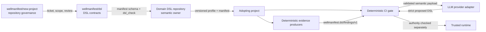
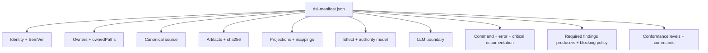
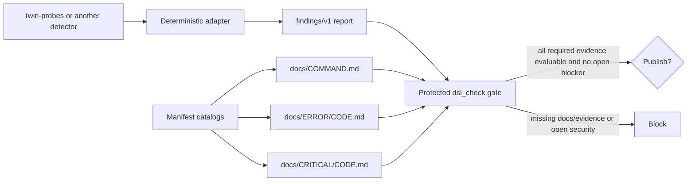
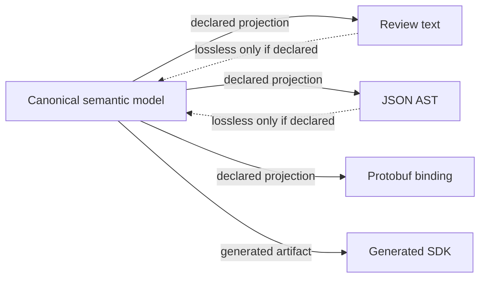
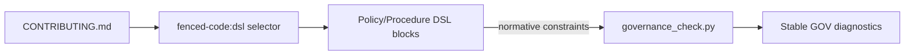
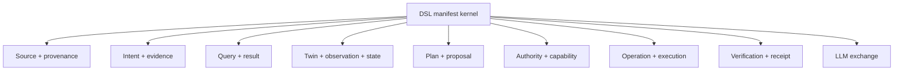

# Architecture

## Outcome

`wellmanifest/dsl` is a neutral contract and conformance layer between DSL
owners, projects that reuse their languages, deterministic runtimes, and LLM
adapters. It standardizes how a language is described and governed without
centralizing every domain's semantics.



## Responsibility boundaries

| Component | Owns | Must not own |
| --- | --- | --- |
| `wellmanifest/new-project` | repository workflow, tickets, bounded changes, review provenance | domain DSL semantics |
| `wellmanifest/dsl` | manifest kernel, cross-language invariants, diagnostics, conformance protocol | every domain grammar |
| Domain DSL repository | grammar/AST, semantics, compatibility, migrations, domain profiles | generic repository governance |
| Adopting project | pinned manifest/profile versions and local bindings | upstream contract redefinition |
| Evidence producer | observations normalized by a deterministic adapter | publication authority or waivers |
| LLM adapter | provider transport and structured-output negotiation | acceptance, authority, execution, receipts |
| Trusted runtime | semantic validation, capability binding, authority, effects, receipts | accepting malformed model output |

Dependency direction is one-way: a domain profile imports the neutral kernel;
the kernel never imports a domain implementation.

## Contract structure



The JSON Schema owns the closed data shape. `dsl_check.py` owns semantic checks
that JSON Schema cannot reliably perform across repository state:

- resolving paths without leaving the repository;
- hashing exact artifact bytes;
- matching artifacts to ownership globs;
- finding multiple manifest owners;
- inspecting Git changes;
- recognizing embedded `dsl` fences;
- enforcing conditional LLM and authority invariants;
- deriving exact case-sensitive help paths and validating page content;
- joining normalized findings to the owning manifest and exact revision;
- failing closed on missing/unevaluable producers and unresolved security.

## Discoverable help and findings boundary



The manifest, not a detector, defines the stable command/error/security
vocabulary. A detector finding joins to that vocabulary through its exact
`helpPath`. Its evidence joins to repository files through relative paths and
SHA-256 values. The report also binds the owning manifest and gated Git SHA.

The adapter is deliberately replaceable: `twin-probes`, validator-agent, or a
domain checker can emit their own native format, then normalize it. The
protected `dsl_check gate` remains the only publication decision point. A local
pre-push hook can call the same command for fast feedback but is not a trust
boundary because it can be bypassed.

## Canonical representation and projections

The canonical representation is the semantic source of truth. Text, YAML,
TOON, JSON, Protobuf, or generated SDKs can be projections, but only one
representation is canonical for a given manifest version.



This avoids a common failure mode where a textual grammar, JSON Schema, and
runtime parser evolve as three independent sources of truth.

## Initial worked profile: new-project contributor DSL

The DSL embedded in `wellmanifest/new-project/CONTRIBUTING.md` is classified as:

| Property | Standard description |
| --- | --- |
| Stable ID | `wellmanifest.new-project.contributing` |
| Domain | `software-governance` |
| Canonical kind | `markdown-embedded` |
| Selector | `fenced-code:dsl` |
| Native version | `9` |
| Manifest version | `9.0.0` |
| Effect model | `declarative-policy` |
| Unknown policy | `reject` |
| LLM boundary | `none` for the language itself |
| Runtime | deterministic governance validator, not arbitrary DSL execution |

The inspected document has a metadata header and rule blocks with stable IDs.
Its major constructs are `DOCUMENT`, `RULE`, `WHEN`, `DO`, `FORBID`, `ASSERT`,
`NEXT`, `STATE`, and `TRANSITION`. Environment declarations add `ENV_FILE`,
`VARIABLE`, and `SECRET`.



The Markdown is the normative source. The validator is an enforcement adapter.
The manifest binds the exact Markdown bytes and declares the adapter as a
conformance command. It does not imply that every `DO` line is a shell command
or that the DSL may execute arbitrary model output.

`CONTRIBUTING.md` can also be supplied as a referenced context artifact inside
an LLM exchange defined by a separate LLM Exchange profile. That use does not
change the contributor DSL's own `llm.mode` from `none`.

## Repository topology

```text
wellmanifest/dsl/
├── spec/                 normative requirements
├── schemas/              strict machine contracts
├── profiles/             future independently versioned profiles
├── examples/             future valid/invalid adoption fixtures
├── src/                  dependency-free deterministic tooling
├── tests/                future cross-project conformance suite
├── docs/                 architecture and adoption guidance
└── project/              repository governance evidence
```

Ticket 001 introduces the standard, schema, validator, and diagrams. A later
ticket will add this repository's own `dsl-manifest.json`, fixtures, and CI so
the standard is governed by its own change gate. A separate ticket in
`wellmanifest/new-project` will adopt a manifest for `CONTRIBUTING.md`; cross-
repository governance evidence must not be stored in this repository.

## Profile family

The neutral kernel is intended to host mappings for profiles such as:



Profiles may reference one another, but authority, execution, verification, and
accepted state remain distinct responsibilities.
