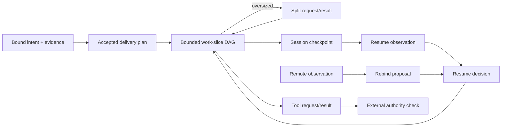

# Execution and recovery profiles

## Purpose

These profiles carry one accepted delivery plan through bounded work,
oversized-slice splitting, session recovery, remote rebinding and typed tool
actions. They are descriptive data contracts. Valid documents never select a
credential, grant authority, execute a capability or accept an LLM proposal.

Natural-language intent may be translated at a separately declared strict LLM
decision boundary. From the accepted plan onward, every transition is a closed
JSON document checked by deterministic validators.



## Closed document family

| Schema discriminator | Responsibility |
| --- | --- |
| `delivery-plan/v1` | Bind one accepted intent, target, base revision and bounded work-slice DAG. |
| `task-split-request/v1` | Report the observed budget overflow without changing the accepted plan. |
| `task-split-result/v1` | Propose bounded replacement slices and an explicit downstream dependency rebinding. |
| `session-checkpoint/v1` | Bind session, ticket, branch, head, workspace, plan, slice and remote observation. |
| `resume-observation/v1` | Record fresh read-only head, workspace and remote facts for a checkpoint. |
| `resume-decision/v1` | Deterministically select `resume`, `recover` or `reject` from bound observations. |
| `remote-binding-observation/v1` | Record repository, remote, catalog route, account profile and fork relation without secrets. |
| `remote-rebind-decision/v1` | Propose or reject one already observed binding; never invent a URI or choose credentials. |
| `tool-action-request/v1` | Bind an action to one capability ID, typed input, declared effects and any external authority artifact. |
| `tool-action-result/v1` | Bind the terminal result to the same action and capability, with output and receipt artifacts. |

Every object uses `additionalProperties: false`, bounded arrays and lengths,
explicit schema discriminators, and immutable SHA-256 bindings. Account and
route fields are identifiers into trusted registries, not usernames, tokens or
transport URLs.

## Delivery plan and split rules

A delivery plan has exactly one accepted state. Its slice IDs are unique. Every
dependency names another slice in the plan, and the directed dependency graph
must be acyclic. Every slice declares non-empty owned paths, effects, explicit
file and time limits, and only catalogued capability references.

A split request is evidence of overflow, not permission to widen a slice. A
proposed split result:

1. binds the same plan reference and digest as the request;
2. names the exact superseded slice;
3. supplies at least two independently bounded replacement slices;
4. declares the deterministic dependency rebinding from the superseded slice
   to a replacement terminal; and
5. keeps `authority_granted=false`.

The validator rejects duplicate IDs, unknown dependencies, cycles, a request
that does not exceed its recorded limit, or a replacement graph whose
dependency rebinding is missing or ambiguous.

## Recovery rules

A checkpoint is useful only with a new observation. The observation is
read-only and binds the checkpoint digest plus the currently observed head,
workspace and remote facts. A resume decision must bind the same checkpoint
and observation and carry stable reason codes. `reject` has no next slice;
`resume` and `recover` name exactly one next slice.

Checkpoint and observation documents do not authorize recovery writes. A
trusted runtime separately proves snapshot receipts, secret scans, leases and
remote freshness before applying a decision.

## Remote rebinding rules

Remote observation records a repository identity, Git remote name, trusted
route-catalog ID, non-secret account-profile reference, fork relation, default
branch and exact observed revision. `valid_until` must be later than
`observed_at`.

A rebind decision may only repeat a binding present in the observation. The
contract deliberately has no credential value or arbitrary URI field.
`propose_only=true`, `credentials_selected=false` and
`authority_granted=false` are invariant. Credential selection and remote
mutation remain trusted-runtime effects outside this DSL.

## Typed tool actions

A tool request binds a stable action ID to one versioned capability ID, typed
input artifact and declared effects. External writes, credential use, quota,
remote sessions and destructive effects require a non-null authority artifact.
That artifact is a reference for the trusted runtime to verify; its presence
does not make the request self-authorizing.

A result is terminal and repeats the action and capability IDs. Success binds
both output reference and digest; every other state requires both to be null.
Receipts remain immutable artifacts. A mismatch between request and result
capability IDs is rejected.

## Conformance

Run:

```bash
python3 tests/profile_contract_test.py
python3 src/dsl_check.py validate profiles/dsl-manifest.json
python3 src/dsl_check.py standards profiles/dsl-manifest.json
```

The fixture validator uses the Draft 2020-12 schema for closed document shape,
then checks cross-document and graph invariants that JSON Schema cannot express:
DAG reachability, split rebinding, checkpoint hashes, remote binding identity
and request/result capability identity.
