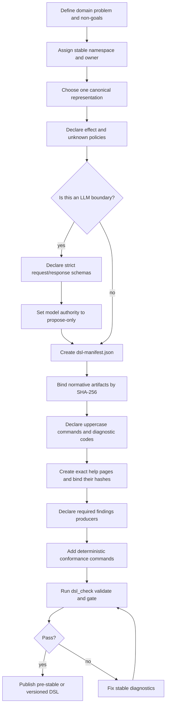
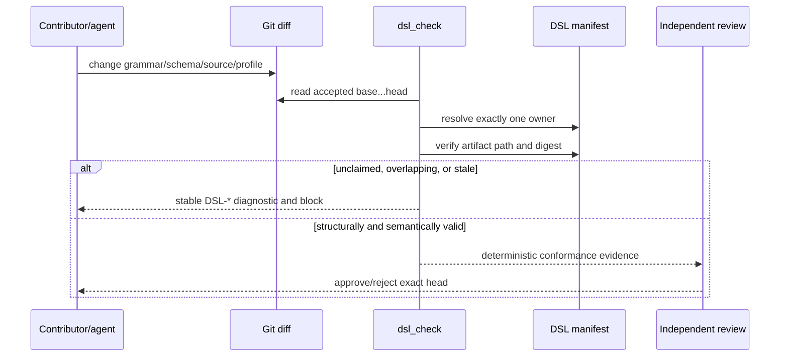
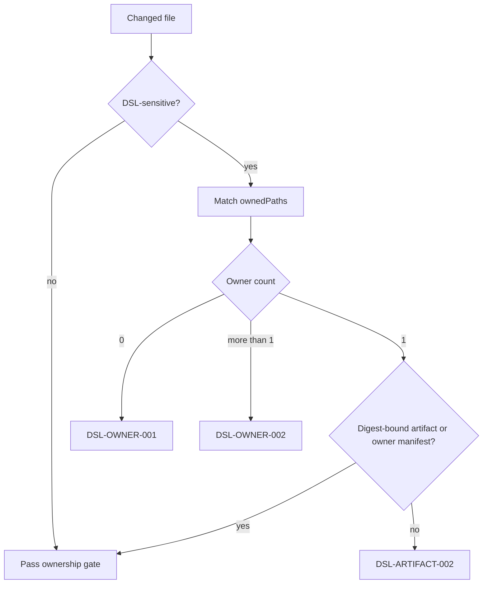
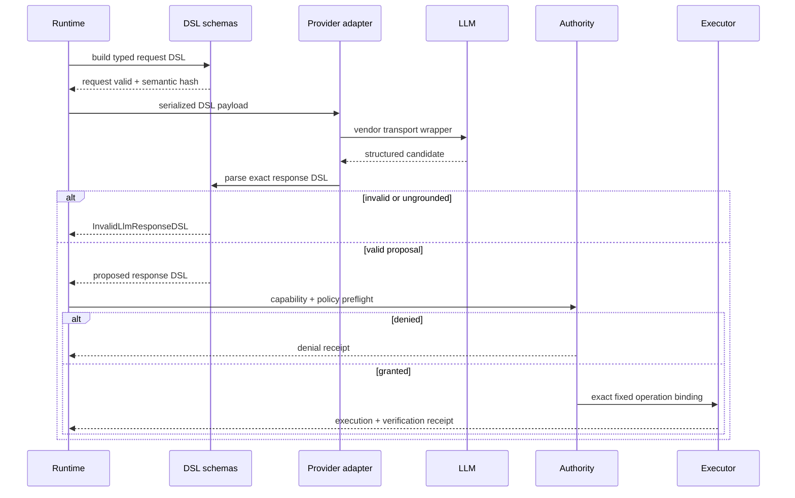
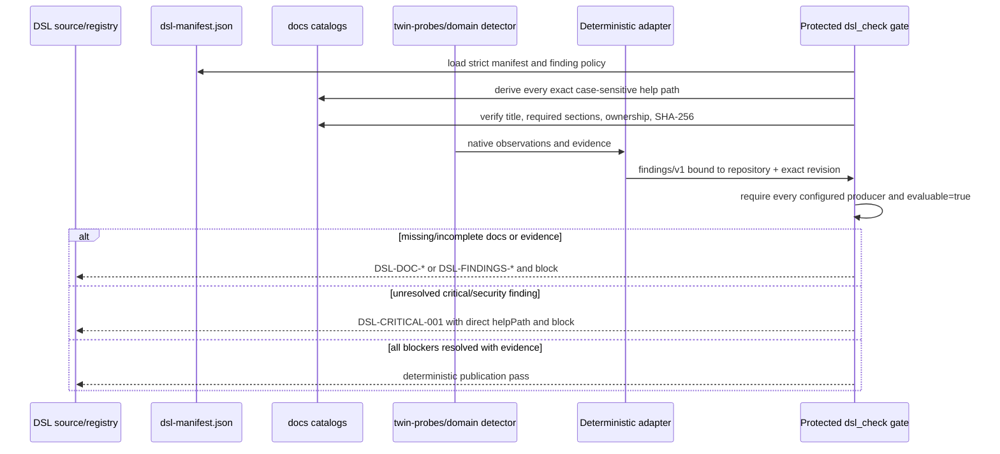
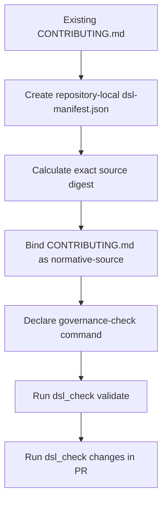

# Logic flows

## Creating a DSL

Creation fails closed when ownership, source identity, authority, or canonical
representation is unresolved.

## Changing a DSL

An updated artifact necessarily changes its SHA-256 digest, forcing an explicit
manifest update. This makes silent grammar or schema drift observable even when
the file still parses.

Compatibility classification remains a reviewer decision backed by explicit
rules. A model MAY suggest `major`, `minor`, or `patch`, but cannot approve its
own classification.

## Changed-file ownership algorithm

For each changed path, `dsl_check changes` performs:

1. Discover all `dsl-manifest.json` files.
2. Validate every manifest and its current artifact hashes.
3. Classify the changed file as DSL-sensitive if it:
   - is covered by any manifest `ownedPaths`;
   - is a manifest or `*schema.json`;
   - uses a known grammar/DSL extension;
   - is under a DSL, schema, grammar, or profile directory; or
   - contains a Markdown `dsl` fence.
4. Require exactly one manifest owner.
5. Require the changed file to be digest-bound as an artifact, except for its
   owner manifest itself.

The changed paths normally come from an accepted Git base and exact head. In a
minimal container without Git they may be passed as repeatable
`--changed-file` values by the protected workflow; an LLM must never construct
the authoritative change list.

## LLM request and response flow

Natural language can appear only as a typed source payload when allowed by the
manifest. Provider metadata, token counts, costs, timestamps, and raw response
hashes belong to a runtime-owned receipt and cannot alter the semantic result
hash.

## Documentation and security publication gate

A normalized finding points to `docs/ERROR/<CODE>.md` or
`docs/CRITICAL/<CODE>.md`; it cannot choose a looser alias. A resolved finding
must carry a summary, exact resolving revision, and digest-bound evidence. An
open critical page remains useful help but never changes the blocking verdict.

If a required producer cannot run, its adapter emits `evaluable=false` with a
failure reason. Absence of a report and an unevaluable security report both
fail closed. Probe output is evidence; only the protected gate has verdict
authority.

## Applying the standard to `new-project/CONTRIBUTING.md`

The current contributor document already contains the language definition and
its semantics. Adoption does not require rewriting those 92 rules.

The repository-local adoption ticket should:

- use `wellmanifest.new-project.contributing` as the stable ID;
- map native `VERSION 9` to manifest SemVer `9.0.0`;
- declare `markdown-embedded` plus `fenced-code:dsl`;
- bind `CONTRIBUTING.md` by exact SHA-256;
- declare every uppercase construct and create `docs/<COMMAND>.md` pages;
- declare governance error/security codes and create exact `ERROR`/`CRITICAL`
  pages before claiming conformance;
- configure at least one deterministic security findings producer;
- classify it as `declarative-policy`;
- preserve the existing deterministic governance checker;
- add `dsl_check changes` to the protected PR checks.

The example digest in the normative standard describes the locally inspected
bytes. The adoption ticket MUST recompute it at its accepted Git base and MUST
not copy the example digest blindly.

## Failure behavior

| Code | Meaning |
| --- | --- |
| `DSL-MANIFEST-001` | Invalid, missing, unknown, or inconsistent manifest field. |
| `DSL-PATH-001` | Absolute, parent-traversing, backslash, or escaping path. |
| `DSL-PATH-002` | Referenced repository file does not exist. |
| `DSL-HASH-001` | Artifact bytes no longer match the manifest digest. |
| `DSL-HASH-002` | Digest is not canonical `sha256:<hex>`. |
| `DSL-OWNER-001` | Changed DSL-sensitive file has no manifest owner. |
| `DSL-OWNER-002` | DSL identity or changed file has multiple owners. |
| `DSL-ARTIFACT-001` | Source/artifact is outside its declared contract. |
| `DSL-ARTIFACT-002` | Changed DSL file is owned but not digest-bound. |
| `DSL-COMPAT-001` | Version or lifecycle compatibility declaration is invalid. |
| `DSL-AUTH-001` | Effect and authority declarations conflict. |
| `DSL-LLM-001` | LLM schemas, strictness, NL policy, or model authority is invalid. |
| `DSL-CONFORMANCE-001` | Claimed conformance evidence is missing. |
| `DSL-GIT-001` | Accepted-base/head change set cannot be established. |
| `DSL-DOC-001` | Required catalog/root/help page is missing or invalid. |
| `DSL-DOC-002` | A help page exists with incorrect filename case. |
| `DSL-DOC-003` | A help page lacks its exact title or required non-empty sections. |
| `DSL-DOC-004` | A help page is not owned and digest-bound by its manifest. |
| `DSL-FINDINGS-001` | A normalized findings report or evidence reference is invalid. |
| `DSL-FINDINGS-002` | A required findings producer is missing or unevaluable. |
| `DSL-FINDINGS-003` | A report does not bind the owning repository/manifest/revision. |
| `DSL-CRITICAL-001` | An unresolved blocking severity or security finding exists. |

Diagnostics are deterministic. Corrective text from an LLM is advisory and
must pass the same gate as a human-authored change.
